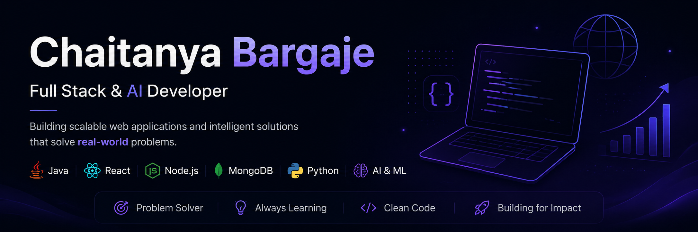

  

# Hi, I'm Chaitanya 👋

Software Developer focused on building scalable full-stack applications, backend systems, and data-driven solutions using JavaScript, Java, and Python.

## 🚀 Tech Stack
- Frontend: React, Next.js, Tailwind CSS
- Backend: Node.js, Express.js
- Databases: MongoDB, PostgreSQL
- Languages: JavaScript, Java, Python
- Core CS: Data Structures & Algorithms
- Data & AI: Machine Learning, Data Analysis

## 📚 Currently Exploring
- Scalable Backend Architecture
- System Design
- Advanced Full Stack Development
- AI/ML Applications

## 🛠️ What I'm Building
- MERN Stack Applications
- Backend APIs & Services
- Data Analysis Projects
- AI/ML-Based Tools
- DSA & Problem-Solving Solutions

## 🎯 Goals
- Build impactful software products
- Strengthen problem-solving and system design skills
- Contribute to meaningful open-source projects
- Develop production-grade applications

## 🌐 Connect With Me
- LinkedIn- https://www.linkedin.com/in/chaitanya-bargaje
- Portfolio
- Email- chetanbargaje2006@gmail.com

## 📊 GitHub Analytics

  

  

  

